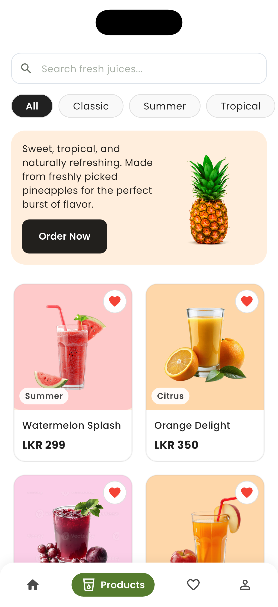
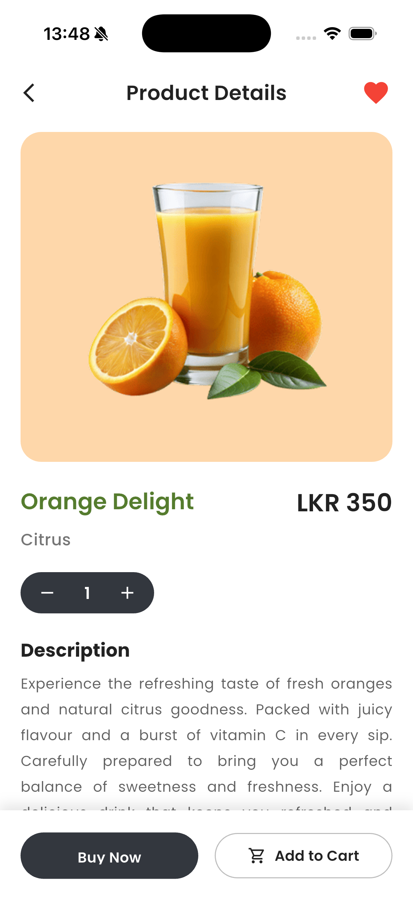
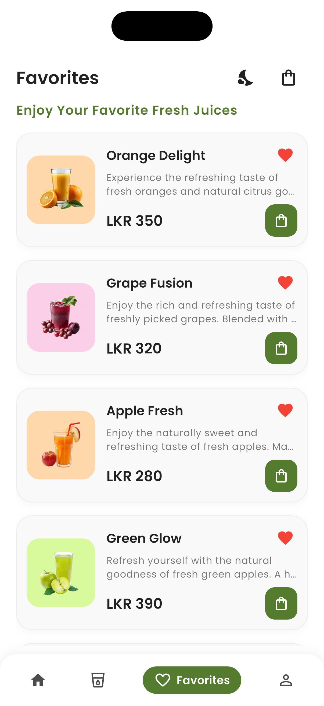
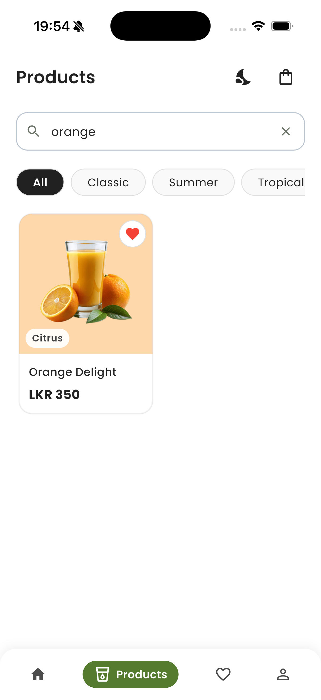
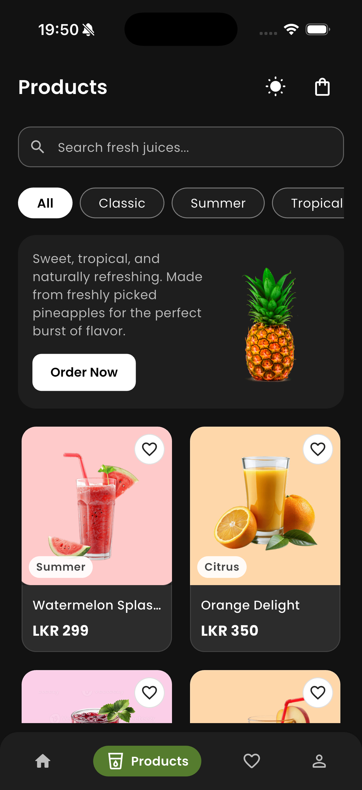
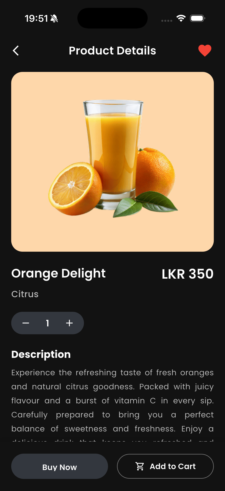
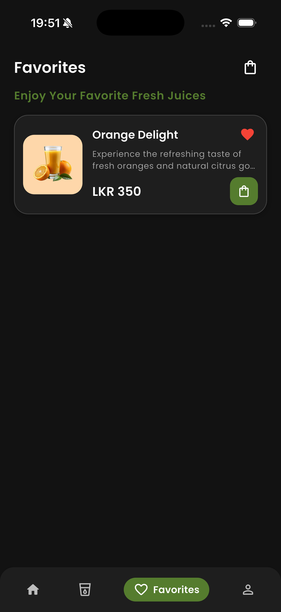
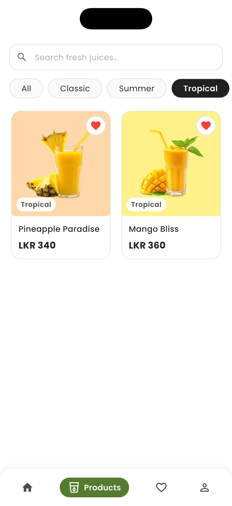
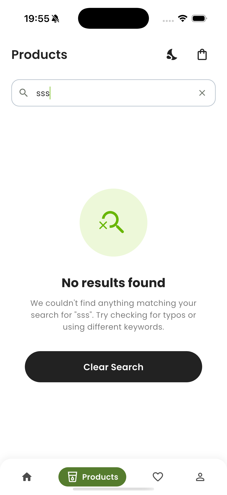

# Juice Catalogue

A modern Flutter product catalogue application built for the **Associate Flutter Developer Practical Assessment**.

The application displays a catalogue of fresh juices with search, category filtering, favourites, dark/light theme support, loading states, error handling, and persistent favourites.

---

## Features

- Responsive product grid display
- Product details screen
- Search products by name (substring matching)
- Category filtering
- Add/remove favourites
- Favourite persistence using SharedPreferences
- Light & Dark theme support
- Loading indicator while fetching products
- Error state with retry option
- Empty states for:
  - No products available
  - No search results
  - No favourite items
- Clean UI with reusable widgets
- Provider state management

---

## Screens

- Product List
- Product Details
- Favourites
- Search
- Loading State
- Error State
- Empty State
- Light Theme
- Dark Theme

---

## Folder Structure

```text
product_catalogue/
│
├── lib/
│   ├── models/
│   ├── providers/
│   ├── screens/
│   ├── services/
│   ├── widgets/
│   ├── utils/
│   └── main.dart
│
├── assets/
│   ├── images/
│   └── products.json
│
├── screenshots/
│   ├── all_products.png
│   ├── category_selection.png
│   ├── search_results.png
│   ├── favourites.png
│   ├── product_view_with_favourite.png
│   ├── product_view_without_favourite.png
│   ├── favourites_empty.png
│   └── search_empty.png
│
├── README.md
└── pubspec.yaml
```

---

## Technologies Used

- Flutter
- Dart
- Provider
- SharedPreferences
- Material 3

---

## Packages

```yaml
provider
shared_preferences
flutter_native_splash
```

---

## Setup Instructions

### 1. Clone Repository

```bash
git clone <repository-url>
```

### 2. Navigate to Project

```bash
cd product_catalogue
```

### 3. Install Dependencies

```bash
flutter pub get
```

### 4. Run Application

```bash
flutter run
```


## Build APK

Generate release APK using:

```bash
flutter build apk --release
```

APK location:

```text
build/app/outputs/flutter-apk/app-release.apk`
```


## Architecture

This project follows a simple layered architecture.

## Models

Contains the Product model used throughout the application.

## Services

Responsible for loading product data from the local JSON file.

## Provider (State Management)

Provider manages:

- Product loading
- Search
- Category filtering
- Favourite products
- Loading state
- Error handling
- Empty states

## Screens

Contains all application screens.

## Widgets

Reusable UI components used throughout the application.

## Utils

Contains theme and application configuration.

---

## State Management

The application uses **Provider** because it is:

- Lightweight
- Easy to understand
- Suitable for medium-sized Flutter applications
- Recommended for this assessment

`ProductProvider` manages:

- Product list
- Search
- Categories
- Favourites
- Loading state
- Error state

---

## Data Integration

Product data is loaded from:

```text
assets/products.json
```

The `ProductService` simulates a network request using a short delay before loading JSON data.

This demonstrates:

- Data parsing
- Loading states
- Error handling

without requiring a backend.

---

#  Favourite Persistence

Favourite products are stored locally using **SharedPreferences**.

Favourite selections remain available after closing and reopening the application.

---

#  Theme Support

The application supports:

- Light Theme
- Dark Theme

The selected theme preference is stored using SharedPreferences.

---

#  Error Handling

The application handles:

- Asset loading failures
- Empty product lists
- No search results

Users can retry when product loading fails.

---

#  Assumptions

- Product data is mocked using a local JSON file.
- Internet connection is not required.
- Images are bundled with the application.
- Favourite data is stored locally on the device.

---

#  Challenges

- Keeping favourite status synchronized across screens.
- Persisting favourites and theme settings.
- Creating reusable widgets.
- Maintaining consistent loading, empty, and error states.
- Supporting both light and dark themes.

---

#  Future Improvements

- Backend API integration
- Shopping cart functionality
- User authentication
- Product sorting
- Product ratings and reviews
- Pagination / Lazy loading
- Better animations
- Unit and widget testing
- Offline caching with a local database

---

#  Demo

A demo video is provided separately as part of the submission package.

---

#  Screenshots

## Product List


## Product Details


## Favourite Selection


## Search & Filtering


## Product List (Dark Mode)


## Product Details (Dark Mode)


## Favourite Selection (Dark Mode)


## Category Selection


## Search - No Results



---

#  Developer

**Sajitha Pathmanathan**  
Flutter Developer